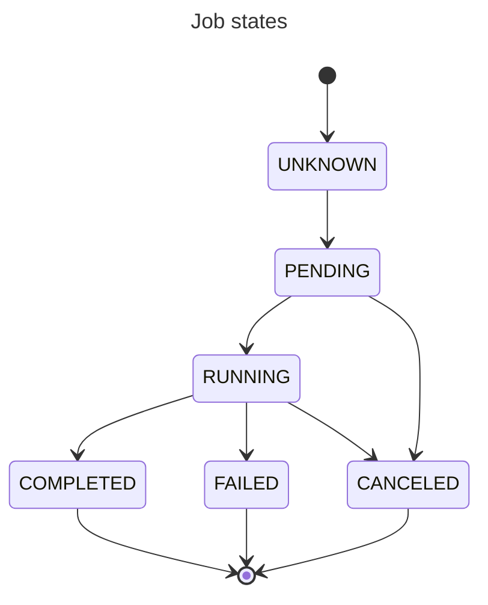

# JOBS & TASKS

Each simulation consists of 1 job and 1 or multiple tasks.

## States

All jobs and tasks which are part of any simulation are in some state:

 * `UNKNOWN` - it is used only for jobs which are not yet submitted but was created in the database, so can be fetched by UI. Simulation with job in this state has no tasks. Simulation with job in this state cannot be canceled.
 * `PENDING` - jobs and tasks in this state are successfully submitted and are waiting for execution.
 * `RUNNING` - jobs and tasks in this state are currently executing.
 * `COMPLETED` - jobs and tasks in this state are successfully completed and they cannot be canceled.
 * `FAILED` - jobs and tasks in this state failed and they cannot be canceled.
 * `CANCELED` - jobs and tasks in this state are canceled.

Diagram below shows possible transitions of states.

